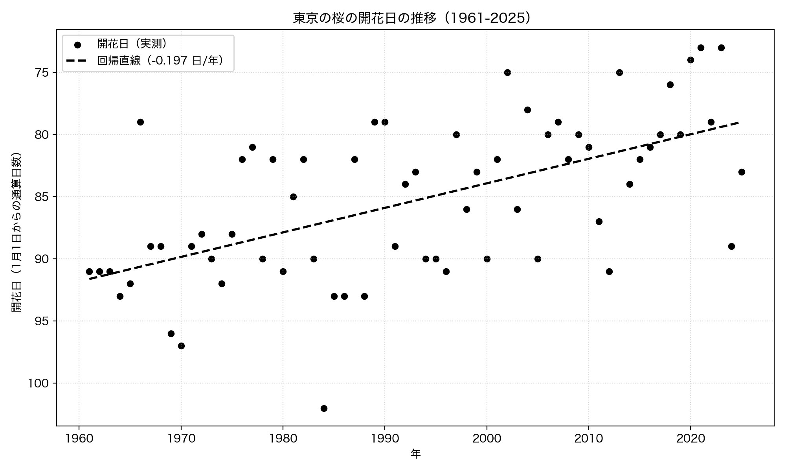
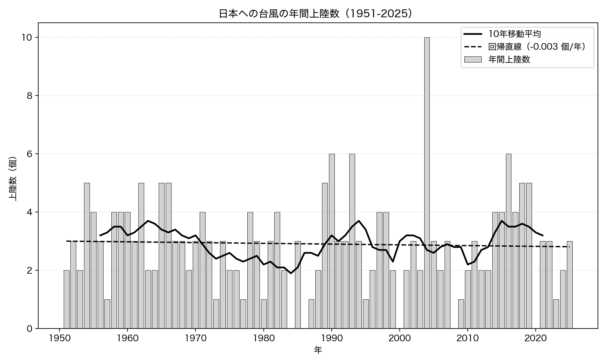
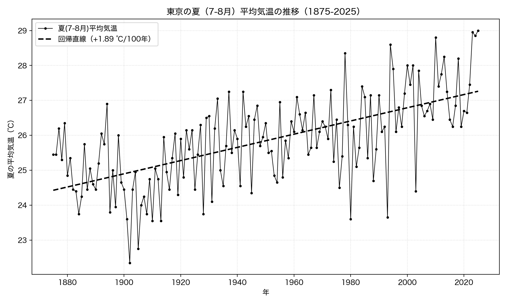
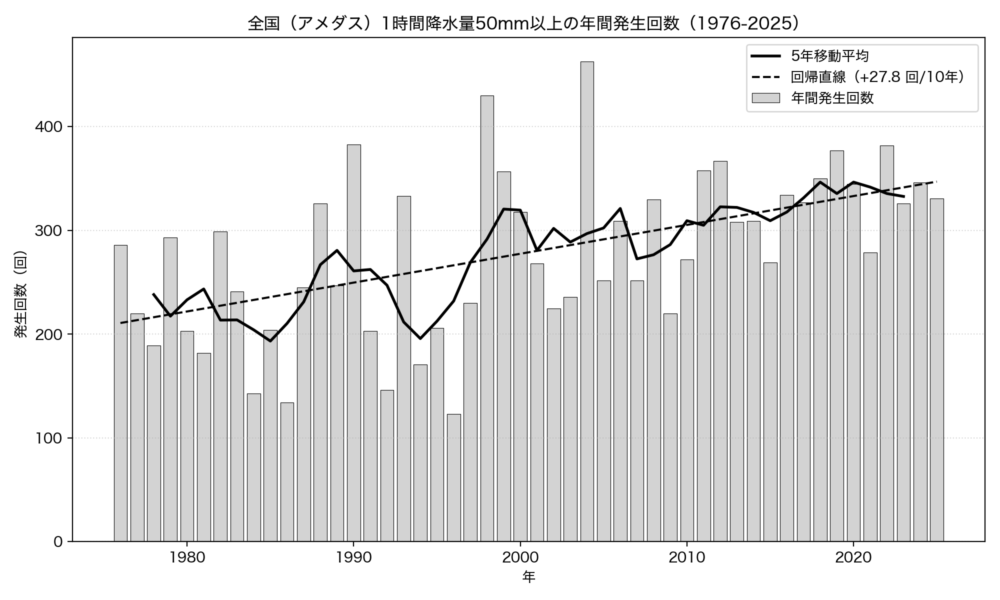

# 第1章 気象 — 日本の空は変わったか

「Python × 公開データ分析 30選」第1章のサンプルコードと分析結果です。

気象庁が公開する長期観測データ（API キー不要）を Python で取得し、4 つの問いに答えます。すべてのコードは単独で実行でき、結果のグラフは `images/` に出力されます。

## セットアップ

```bash
pip install -r ../../requirements.txt
```

各スクリプトは初回実行時にデータを取得して `data/` にキャッシュし、2 回目以降はキャッシュを使います。

## Recipe 01: 桜の開花日は早まっているか

```bash
python recipe01_sakura_trend.py
```

東京の桜の開花日（気象庁 過去のさくらの開花日、1961-2025）を 1 月 1 日からの通算日数に変換し、線形回帰でトレンドを調べます。

**結果**: 65 年間で開花日が約 12.6 日早まっていました（傾き -0.197 日/年、p=2.5e-07）。統計的に有意な早期化トレンドです。



## Recipe 02: 台風の上陸数は増えているか

```bash
python recipe02_typhoon_landing.py
```

日本への台風の年間上陸数（気象庁、1951-2025）を取得し、線形回帰と 10 年移動平均でトレンドを調べます。

**結果**: 増加トレンドは確認できませんでした（傾き -0.003 個/年、p=0.78 で非有意）。最初の 10 年も直近 10 年も平均 3.20 個で一致。「台風が増えている」という体感はデータに裏付けられませんでした。



## Recipe 03: 東京の夏は暑くなっているか

```bash
python recipe03_tokyo_summer_temp.py
```

東京の 7 月・8 月の平均気温（気象庁 過去の気象データ、1875-2025）から夏の平均気温を求め、線形回帰でトレンドを調べます。

**結果**: 100 年あたり約 1.89℃ のペースで上昇（p=5.2e-18）。最初の 30 年平均 24.91℃ に対し直近 30 年平均は 27.22℃。ただし都市化（ヒートアイランド）の影響を含みます。



## Recipe 04: ゲリラ豪雨は増えているか

```bash
python recipe04_heavy_rain.py
```

全国アメダスの 1 時間降水量 50mm 以上の年間発生回数（気象庁、1976-2025）を取得し、線形回帰と 5 年移動平均でトレンドを調べます。

**結果**: 10 年あたり約 27.8 回のペースで増加（p=0.00011、信頼水準 99%）。最初の 10 年平均 226 回に対し直近 10 年平均は 340 回で、約 1.5 倍に増えています。台風の「数」は増えていないのに、短時間の強い雨は明確に増えていました。



## データ出典

- 気象庁 過去のさくらの開花日: https://www.data.jma.go.jp/sakura/data/sakura003_07.html
- 気象庁 台風の上陸数: https://www.data.jma.go.jp/yoho/typhoon/statistics/landing/landing.html
- 気象庁 過去の気象データ（東京）: https://www.data.jma.go.jp/obd/stats/etrn/view/monthly_s3.php?prec_no=44&block_no=47662
- 気象庁 大雨など極端現象の長期変化: https://www.data.jma.go.jp/cpdinfo/extreme/extreme_p.html

いずれも API キーは不要です。データは各機関の利用規約に従って利用してください。
