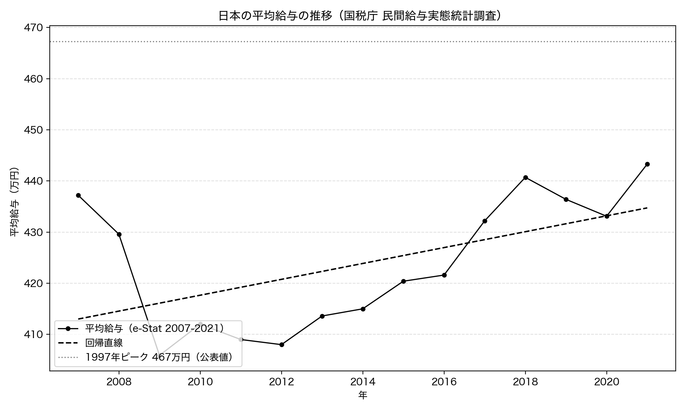
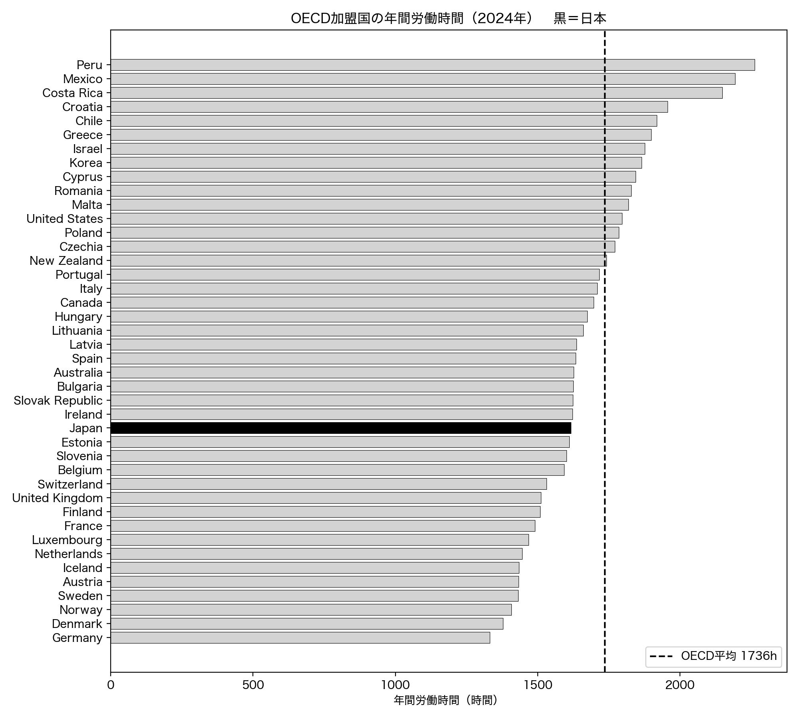
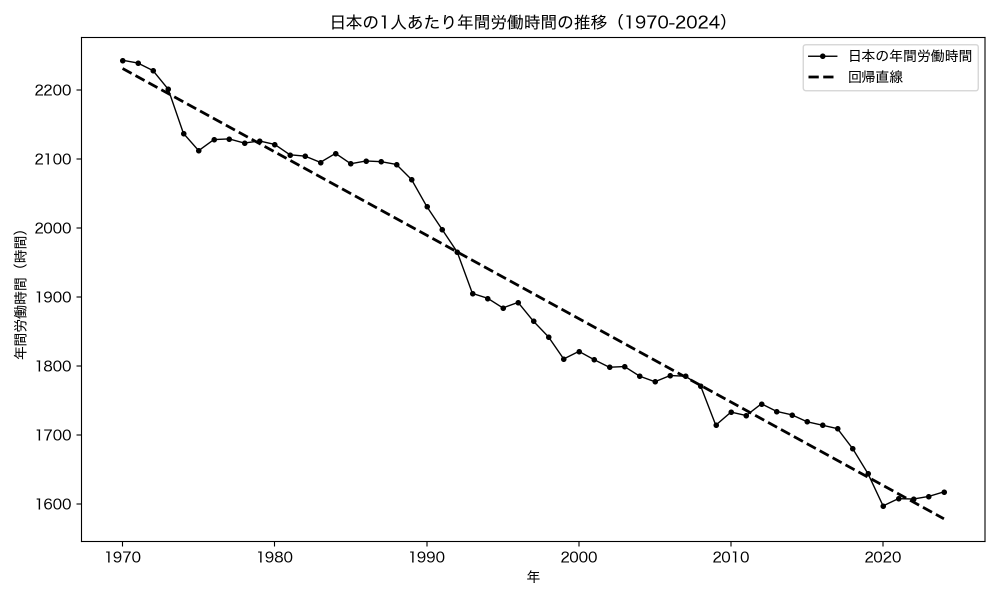
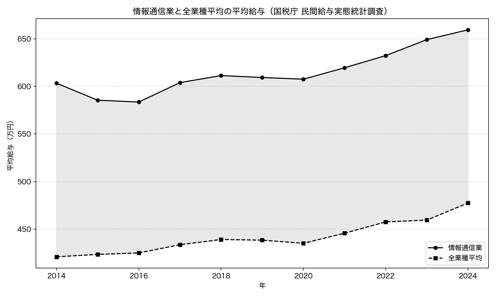

# 第2章 年収・賃金 — 日本人は本当に貧しくなったか

「Python × 公開データ分析 30選」第2章のサンプルコードと分析結果です。

国税庁「民間給与実態統計調査」（e-Stat API）と OECD の労働時間データ（SDMX API）を Python で取得し、3 つの問いに答えます。すべてのコードは単独で実行でき、結果のグラフは `images/` に出力されます。

## セットアップ

```bash
pip install -r ../../requirements.txt
```

各スクリプトは初回実行時にデータを取得して `data/` にキャッシュし、2 回目以降はキャッシュを使います。

### e-Stat API キー（Recipe 05 と Recipe 07 で必要）

Recipe 05・07 は政府統計の総合窓口 [e-Stat](https://www.e-stat.go.jp/) の API を使います。利用は無料ですが、アプリケーション ID（`appId`）の発行が必要です。

1. [e-Stat](https://www.e-stat.go.jp/) で利用登録する
2. マイページの「API 機能（アプリケーション ID 発行）」で `appId` を発行する
3. このディレクトリ（`chapters/ch02/`）に `.env` ファイルを作り、次の 1 行を書く

```text
ESTAT_APP_ID=発行されたあなたのID
```

`.env` は `.gitignore` で除外されており、コミットされません。Recipe 06（OECD）はキー不要です。

## Recipe 05: 平均年収は30年上がっていないか

```bash
python recipe05_average_income.py
```

国税庁 民間給与実態統計調査の「1 年を通じて勤務した給与所得者の平均給与（全体）」を、e-Stat API から 2007-2021 年（従来の復元推計、3 つの統計表を連結）取得し、線形回帰でトレンドを調べます。

**結果**: 2007 年の 437.2 万円から 2021 年の 443.3 万円へ、15 年間で 6.1 万円しか増えていませんでした（傾き +1.55 万円/年、p=0.038、r=0.539）。さらに、この統計の長期ピークである 1997 年の 467.3 万円（国税庁公表値）を、直近の 2021 年は 24 万円下回っています。「平均給与はこの四半世紀で増えていない」という体感は、データに裏付けられました。ただしこの平均はパート・非正規を含む名目値で、構成変化の影響を受ける点に注意が必要です。



## Recipe 06: 日本の労働時間は世界何位か

```bash
python recipe06_working_hours.py
```

OECD の平均年間実労働時間（全就業者）を SDMX API（キー不要）から取得し、2024 年の国際ランキングと、日本の 1970-2024 年の長期推移を分析します。

**結果**: 2024 年の日本は 1617 時間で、OECD 集計行を除く 42 カ国中、多いほうから第 27 位。OECD 平均 1736 時間を下回り、韓国（1865 時間・8 位）や米国（1796 時間・12 位）より少ないという結果でした。「世界一の働きすぎ」という体感は平均労働時間の統計では裏付けられません。日本の労働時間は 1970 年の 2243 時間から 626 時間減り続けています（傾き -12.09 時間/年、p=2.4e-40）。ただしこの平均にはパート増加の影響が含まれます。





## Recipe 07: IT業界の平均年収は本当に高いか

```bash
python recipe07_it_salary.py
```

国税庁 民間給与実態統計調査の業種別データ（新しい復元推計手法、2014-2024 年）を e-Stat API から取得し、「情報通信業」と全業種「合計」の平均給与を年ごとに比べます。

**結果**: 情報通信業の平均給与は全期間で全業種平均を上回り続けていました。2024 年は情報通信業 659.5 万円に対し全業種平均 477.5 万円で、差は 182 万円、倍率にして約 1.38 倍。しかもこの倍率は 11 年間ずっと 1.37-1.43 倍の狭い範囲に収まっています（期間平均 1.393 倍）。「IT 業界は給料が高い」という通説は、業種平均のレベルではデータに裏付けられました。ただし「情報通信業」は通信・放送・出版なども含む大分類で、エンジニア個人の年収や IT 企業だけを切り出した値ではありません。


