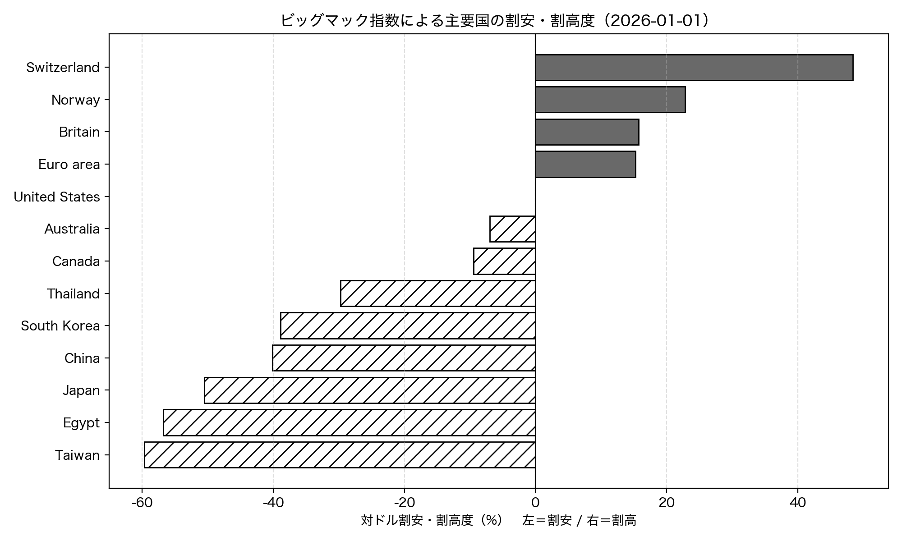
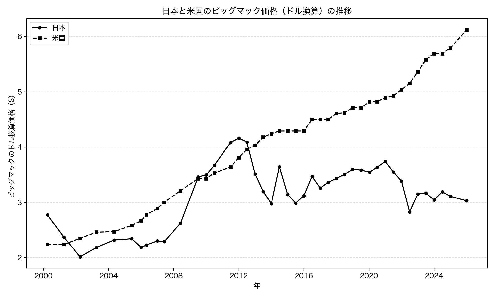
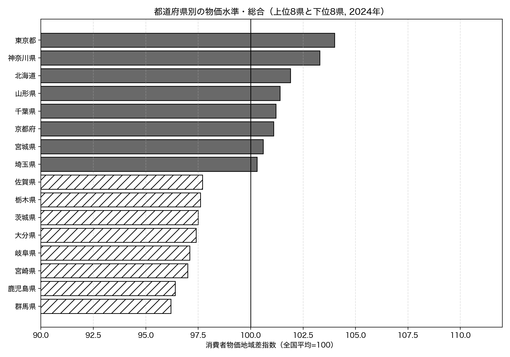
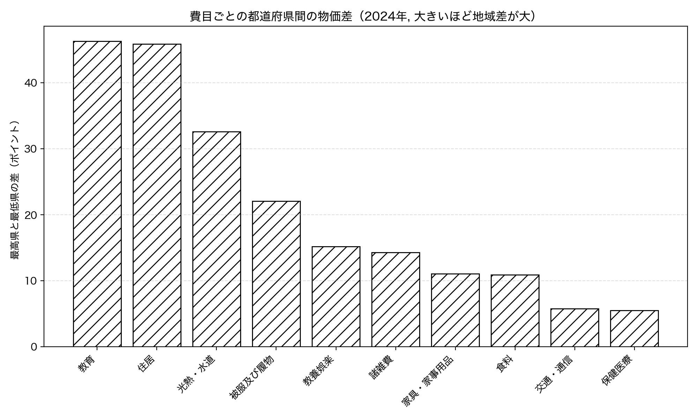
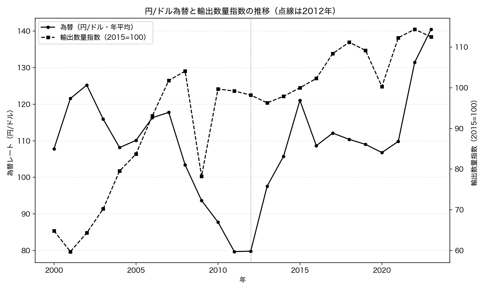
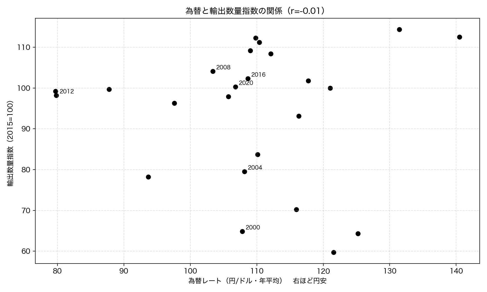

# 第3章 物価・購買力 — 「安い日本」の正体

「Python × 公開データ分析 30選」第3章のサンプルコードと分析結果です。

ビッグマック指数（The Economist）・消費者物価地域差指数（e-Stat API）・為替と輸出数量指数（FRED / World Bank）を Python で取得し、「安い日本」と物価をめぐる 3 つの問いに答えます。すべてのコードは単独で実行でき、結果のグラフは `images/` に出力されます。

## セットアップ

```bash
pip install -r ../../requirements.txt
```

各スクリプトは初回実行時にデータを取得して `data/` にキャッシュし、2 回目以降はキャッシュを使います。

### e-Stat API キー（Recipe 09 で必要）

Recipe 09 は政府統計の総合窓口 [e-Stat](https://www.e-stat.go.jp/) の API を使います。利用は無料ですが、アプリケーション ID（`appId`）の発行が必要です。

1. [e-Stat](https://www.e-stat.go.jp/) で利用登録する
2. マイページの「API 機能（アプリケーション ID 発行）」で `appId` を発行する
3. このディレクトリ（`chapters/ch03/`）に `.env` ファイルを作り、次の 1 行を書く

```text
ESTAT_APP_ID=発行されたあなたのID
```

`.env` は `.gitignore` で除外されており、コミットされません。Recipe 08（GitHub CSV）と Recipe 10（FRED / World Bank）はキー不要です。

## Recipe 08: ビッグマック指数で購買力を比較する

```bash
python recipe08_bigmac_index.py
```

The Economist が公開しているビッグマック指数（GitHub CSV、キー不要）を取得し、各国のビッグマックをドル換算して、米国を基準に何%割安・割高かを比較します。さらに日本のドル換算価格の推移も追います。

**結果**: 2026 年 1 月時点で、日本のビッグマックはドル換算 3.03 ドル。米国（6.12 ドル）のちょうど半分で、対ドルでは約 51% 割安、安い順では 54 カ国中 7 位でした。アジアでは台湾（-59.6%）・中国（-40.2%）・韓国（-38.9%）もそろって割安で、割高なのはスイス（+48.4%）や英国（+15.7%）などの欧州勢。日本のドル換算価格は 2000 年の 2.77 ドルからほぼ横ばいで、6 ドルを超えた米国との差が広がっています。ただし割安の主因は近年の円安で、ビッグマック指数はあくまで購買力の目安です。





## Recipe 09: 都道府県別の物価差はどのくらいか

```bash
python recipe09_price_gap.py
```

総務省の消費者物価地域差指数（全国平均=100）を e-Stat API から取得し、47 都道府県の物価水準と、費目ごとの地域差を分析します。

**結果**: 2024 年の総合指数で最も高いのは東京都の 104.0、最も低いのは群馬県の 96.2 で、差は 7.8 ポイント。神奈川県（103.3）・北海道（101.9）が続きます。総合の差は意外に小さいですが、費目に分けると景色が変わります。最高県と最低県の差は教育（46.3）と住居（45.9）が突出して大きく、光熱・水道（32.6）が続く一方、保健医療（5.5）・交通通信（5.8）は全国ほぼ同水準。「東京は物価が高い」の正体は、主に住居と教育の高さにありました。





## Recipe 10: 円安で日本の輸出は増えたか

```bash
python recipe10_yen_export.py
```

FRED の円/ドル為替（DEXJPUS）と World Bank の輸出数量指数（TX.QTY.MRCH.XD.WD、どちらもキー不要）を年次に集計し、「円安＝輸出増」という通説を数量ベースで検証します。輸出「額」ではなく「数量」を使うのがポイントです。

**結果**: 超円高だった 2012 年（79.8 円/ドル）から 2023 年（140.5 円/ドル）まで、円は対ドルで 76% も安くなりました。それでも輸出数量指数は 98.2 から 112.5 へ、わずか 14.6% しか増えていません。為替と輸出数量指数の相関係数は r=-0.009（p=0.9665）でほぼゼロ、散布図でも円安（右側）ほど輸出数量が増える傾向は見られません。「円安＝輸出増」は、少なくとも数量ベースでは成り立っていませんでした。輸出「額」は為替・価格の押し上げで増えて見えますが、実際に運ぶ量は別物です。




