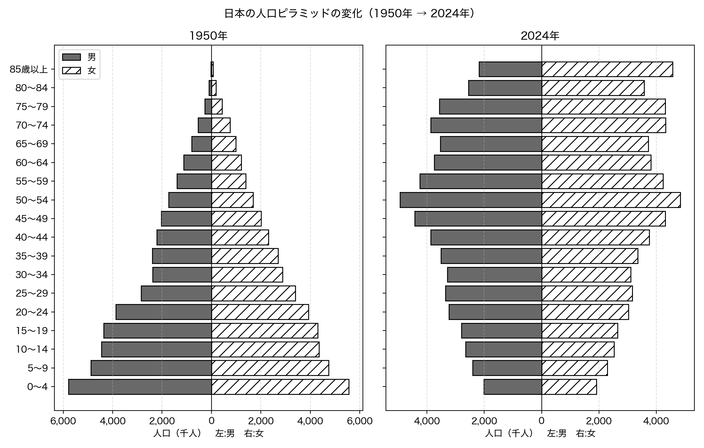
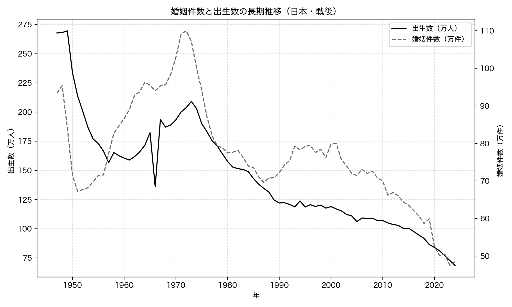
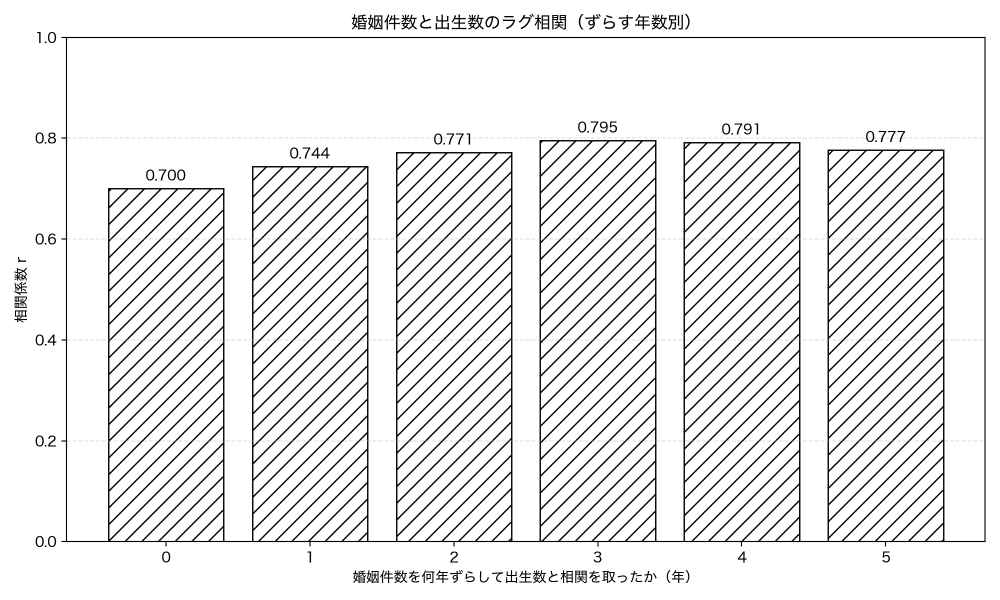
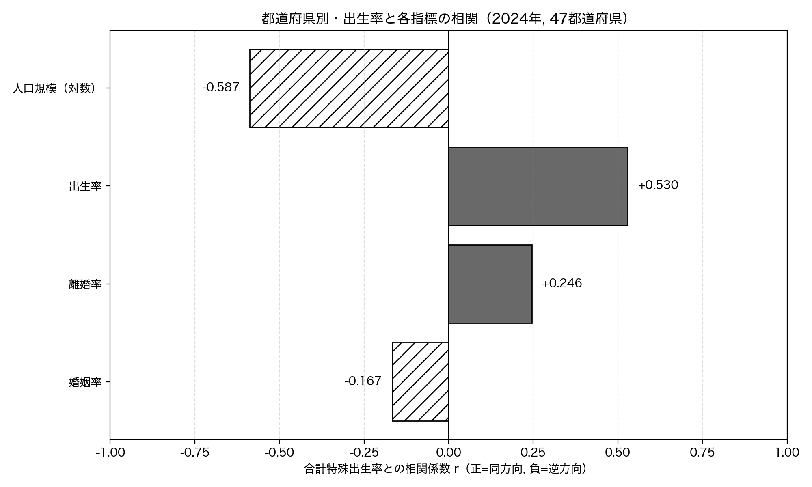
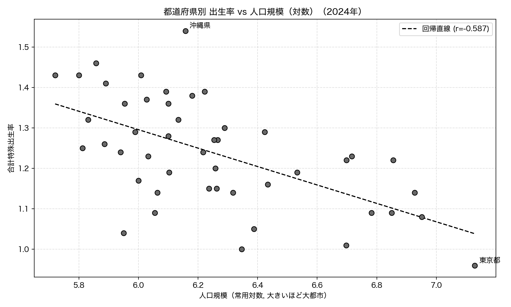
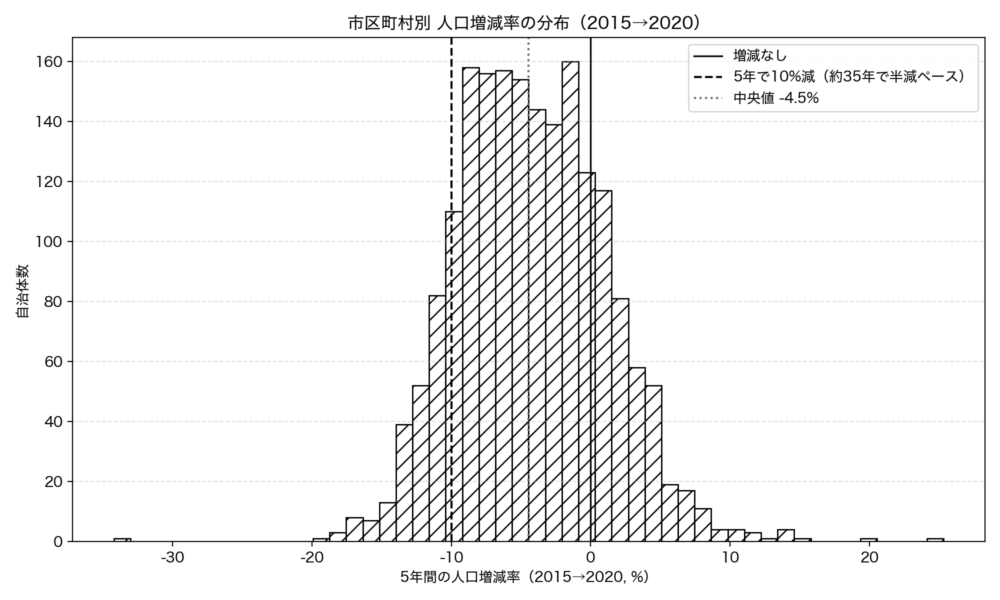

# 第4章 人口・少子化 — 日本はどこへ向かうか

「Python × 公開データ分析 30選」第4章のサンプルコードと分析結果です。

人口ピラミッド・婚姻と出生・都道府県別の出生率・市区町村別の人口増減を、すべて e-Stat（政府統計の総合窓口）の API から取得し、人口にまつわる 4 つの問いに答えます。とくに Recipe 12・13 では、本書の核心テーマである「相関と因果は違う」を、婚姻と出生の関係を題材に掘り下げます。すべてのコードは単独で実行でき、結果のグラフは `images/` に出力されます。

## セットアップ

```bash
pip install -r ../../requirements.txt
```

各スクリプトは初回実行時にデータを取得して `data/` にキャッシュし、2 回目以降はキャッシュを使います。

### e-Stat API キー（第4章は全レシピで必要）

第4章の Recipe 11〜14 はすべて、政府統計の総合窓口 [e-Stat](https://www.e-stat.go.jp/) の API を使います。利用は無料ですが、アプリケーション ID（`appId`）の発行が必要です。

1. [e-Stat](https://www.e-stat.go.jp/) で利用登録する
2. マイページの「API 機能（アプリケーション ID 発行）」で `appId` を発行する
3. このディレクトリ（`chapters/ch04/`）に `.env` ファイルを作り、次の 1 行を書く

```text
ESTAT_APP_ID=発行されたあなたのID
```

`.env` は `.gitignore` で除外されており、コミットされません。

## Recipe 11: 人口ピラミッドの変化を可視化する

```bash
python recipe11_population_pyramid.py
```

国勢調査（1950 年）と人口推計（2024 年）から年齢 5 歳階級・男女別の人口を取得し、左右対称の横棒グラフ（人口ピラミッド）で並べて、戦後の人口構成の変化を可視化します。出所が異なる 2 時点を比べるため、単位（人 / 千人）をそろえる前処理がポイントです。

**結果**: 1950 年は子どもが多い富士山型で、65 歳以上はわずか 4.9%、15 歳未満は 35.4%。それが 2024 年には、団塊世代（75〜79 歳）と団塊ジュニア（50〜54 歳）の 2 つの膨らみを持つつぼ型に変わり、65 歳以上は 29.3%（約 6 倍）、15 歳未満は 11.2%（3 分の 1 以下）に。総人口は約 8,411 万人から約 1 億 2,380 万人へ増えましたが、その大半は中高年層でした。



## Recipe 12: 少子化と婚姻率、どっちが原因か

```bash
python recipe12_marriage_birth.py
```

人口動態統計から戦後の婚姻件数と出生数の長期推移を取得し、相関を計算します。さらに婚姻件数を数年ずらして出生数と相関を取るラグ相関で、「結婚が出産に先行する」関係を確かめます。相関が強くてもそれを因果と読んではいけない理由を、本章の核心として扱います。

**結果**: 婚姻件数は 1972 年の約 110 万件をピークに 2024 年は約 48.5 万件へ、出生数は 1949 年の約 270 万人から約 68.6 万人へ減少しました。合計特殊出生率も 4.54（1947 年）から 1.15（2024 年）へ低下。同じ年の婚姻件数と出生数の相関は r=0.700 と強く、婚姻件数を 3 年ずらすと r=0.795 まで上がります。ただし、相関が強いことと「結婚を増やせば少子化が止まる」という因果は別物です。婚姻も出生も、若年人口の規模・経済・価値観という共通の背景に同時に押されており、相関の一部は見かけ（交絡）かもしれません。





## Recipe 13: 出生率と何が相関するか

```bash
python recipe13_tfr_correlates.py
```

47 都道府県の横断データ（2024 年）で、合計特殊出生率（TFR）と婚姻率・離婚率・人口規模などの相関を計算し、相関の強い順に並べます。Recipe 12 が「時系列」で見たのに対し、ここは「都道府県の差」という別の切り口です。

**結果**: TFR が最も高いのは沖縄県の 1.54、最も低いのは東京都の 0.96。上位は地方県、下位は大都市を含む都道府県が並びます。TFR と最も強く相関したのは人口規模（対数）で r=-0.587、つまり大都市ほど TFR が低い。意外なことに、Recipe 12 の時系列では強く相関した婚姻率は、都道府県の横断では r=-0.167（p=0.261）とほぼ無相関でした。同じ「婚姻と出生」でも、時系列で見るか横断で見るかで相関の姿はまるで違います。相関は分析の切り口に依存します。





## Recipe 14: 消滅可能性都市を自分で特定する

```bash
python recipe14_disappearing_cities.py
```

2020 年国勢調査の市区町村別人口増減率（2015→2020）から、人口減少が大きい自治体を「消滅可能性が高い候補」としてランキングします。増田レポートの定義（若年女性の将来推計半減）とは異なり、実測の総人口増減率を代理指標として使う点に注意します。

**結果**: 市区町村別の人口増減率の中央値は -4.5% で、78.0% の自治体が人口を減らしていました。5 年で 10% 以上減った自治体は 237 件（全 1881 件の 12.6%）で、このペースが続けば約 35 年で人口が半減します。減少率の上位には北海道の旧産炭地（夕張市 -17.1% など）や過疎の山村が並び、逆に東京都心（中央区 +19.8%）やつくばエクスプレス沿線の流山市（+14.6%）は人口を増やしました。なお減少率 1 位の球磨村（-34.2%）は 2020 年の熊本豪雨による一時的な流出を含む特殊例で、構造的な過疎とは性質が異なります。データは定義と限界を押さえて読むことが大切です。


