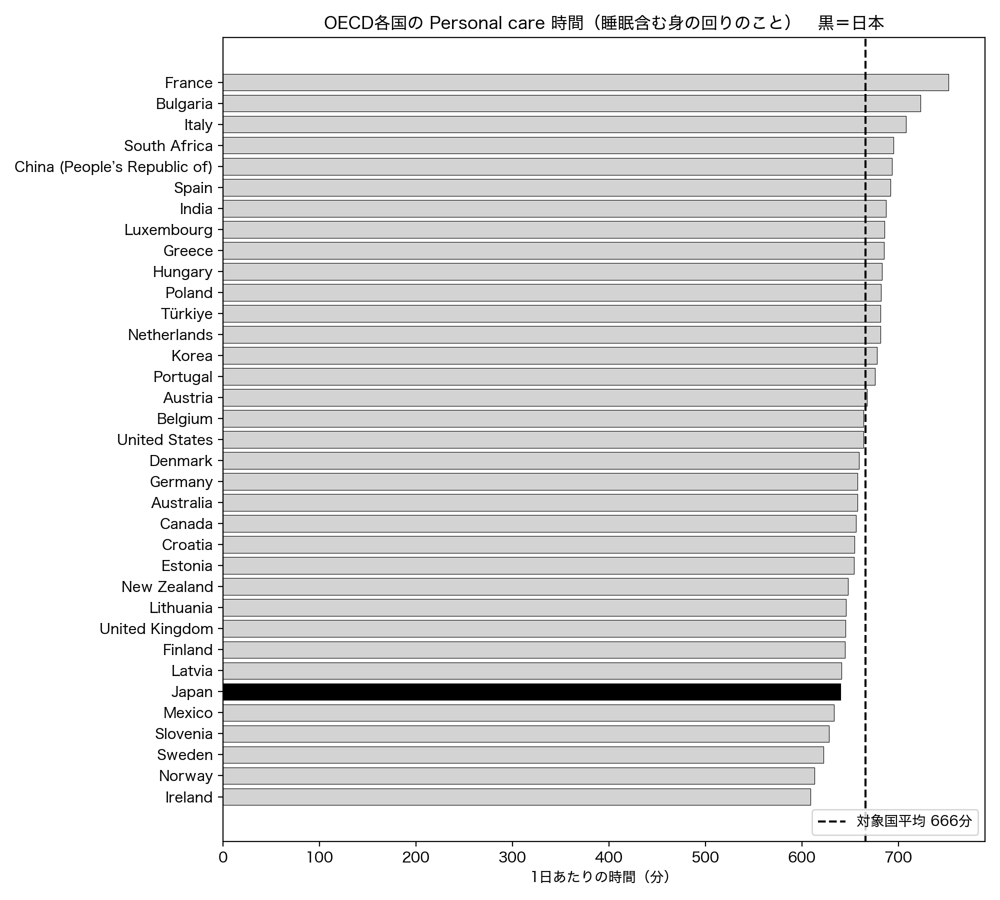
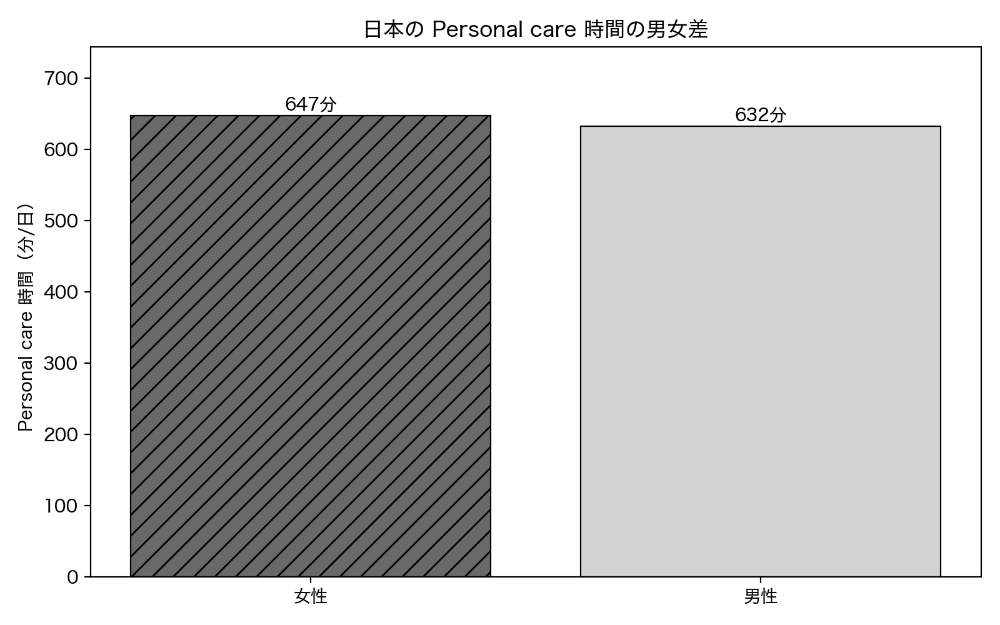
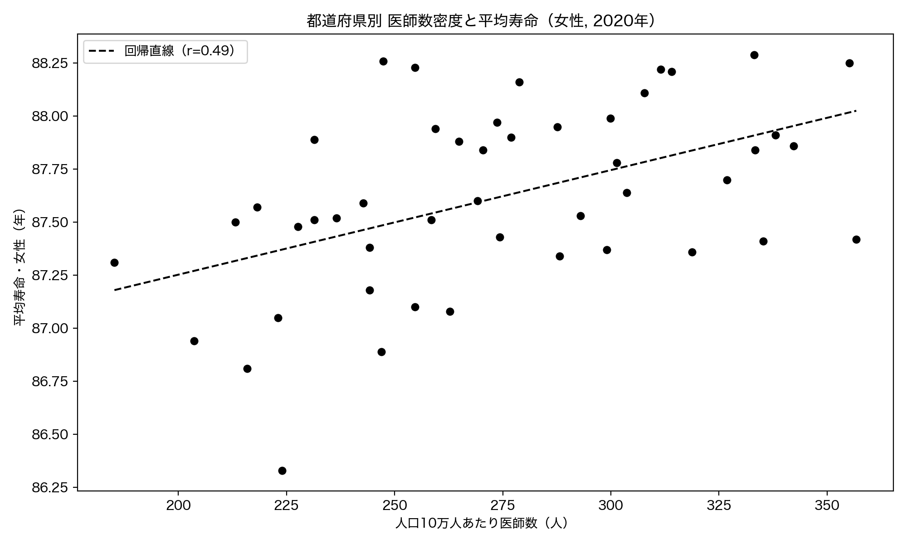
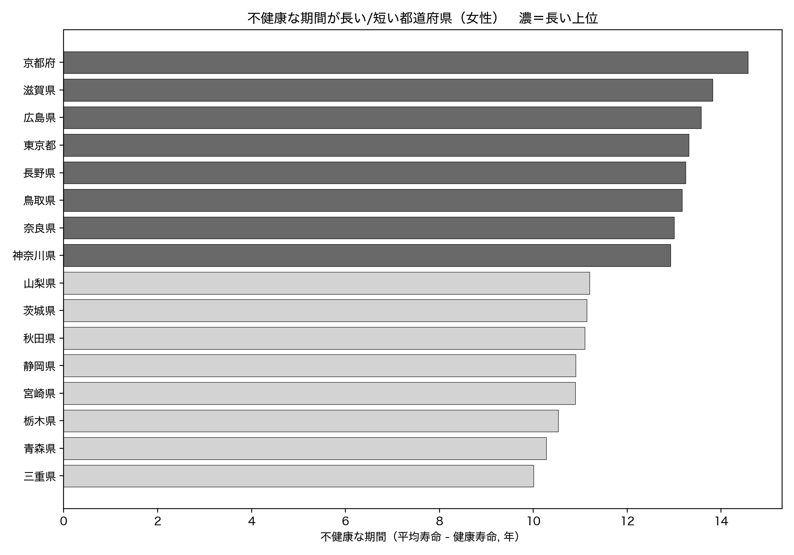
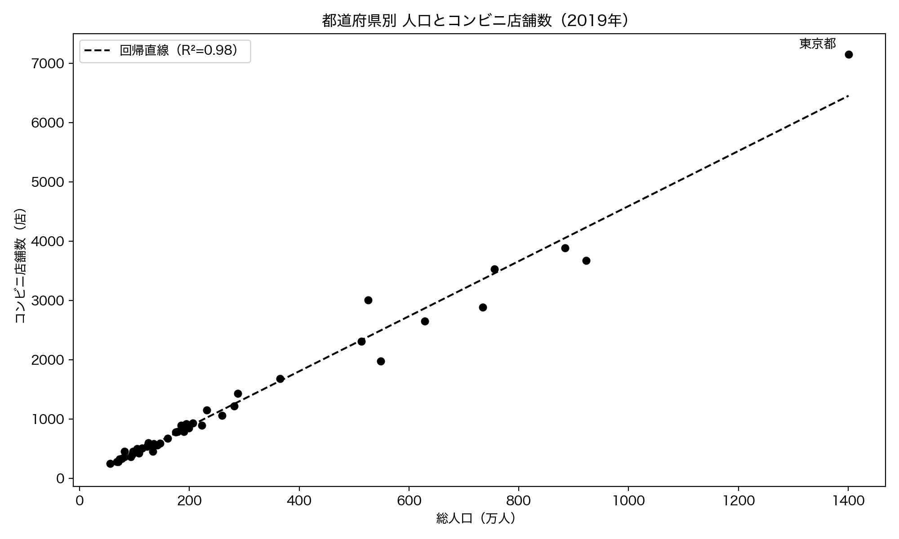
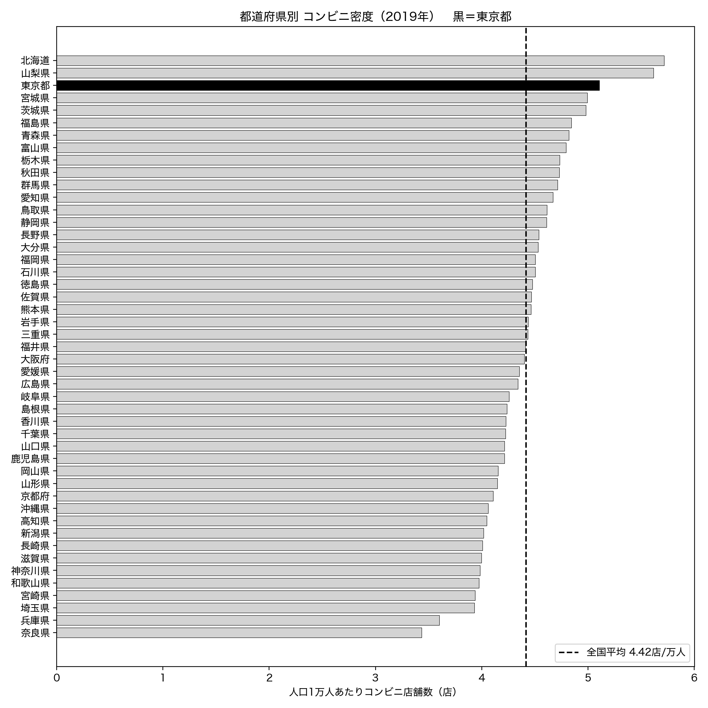
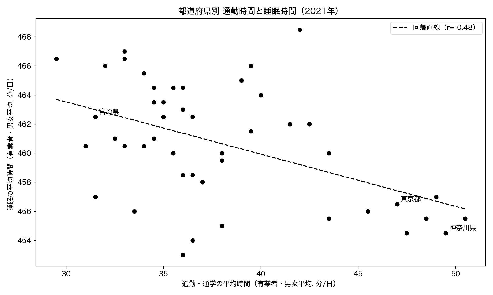
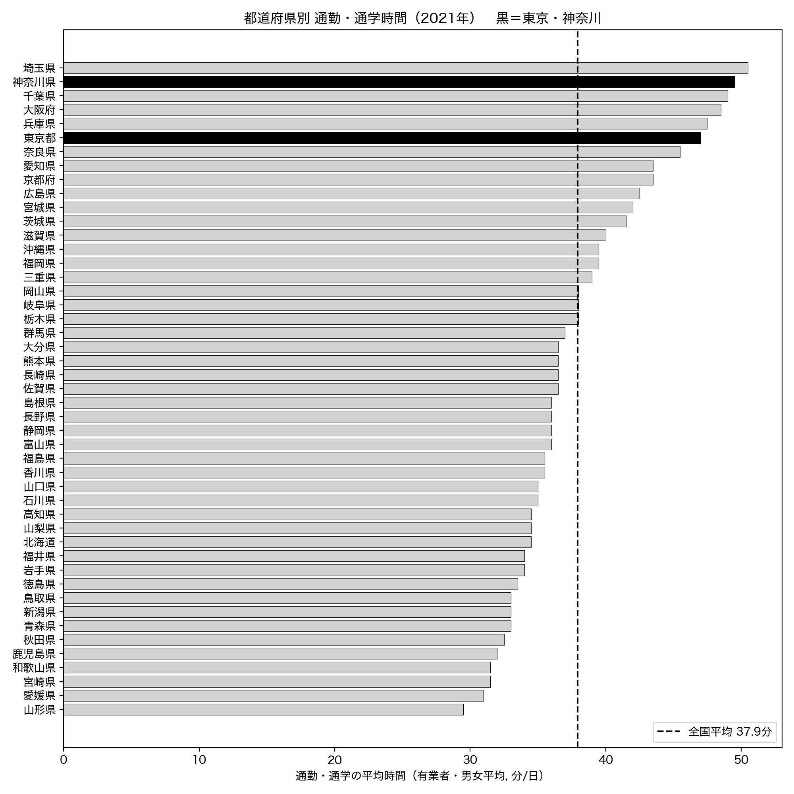

# 第5章 健康・生活 — データが語る日本人の暮らし

「Python × 公開データ分析 30選」第5章のサンプルコードと分析結果です。

睡眠を含む生活時間・平均寿命・コンビニの数・通勤時間を、OECD（経済協力開発機構）と e-Stat（政府統計の総合窓口）の公開データから取得し、暮らしにまつわる 4 つの問いに答えます。Recipe 16・17・18 では、本書の核心テーマである「相関と因果は違う」を、医師数と寿命・人口とコンビニ・通勤と睡眠の関係を題材に掘り下げます。すべてのコードは単独で実行でき、結果のグラフは `images/` に出力されます。

## セットアップ

```bash
pip install -r ../../requirements.txt
```

各スクリプトは初回実行時にデータを取得して `data/` にキャッシュし、2 回目以降はキャッシュを使います。

### e-Stat API キー（Recipe 16・17・18 で必要）

Recipe 16・17・18 は、政府統計の総合窓口 [e-Stat](https://www.e-stat.go.jp/) の API を使います。利用は無料ですが、アプリケーション ID（`appId`）の発行が必要です（Recipe 15 は OECD のデータのみで API キー不要）。

1. [e-Stat](https://www.e-stat.go.jp/) で利用登録する
2. マイページの「API 機能（アプリケーション ID 発行）」で `appId` を発行する
3. このディレクトリ（`chapters/ch05/`）に `.env` ファイルを作り、次の 1 行を書く

```text
ESTAT_APP_ID=発行されたあなたのID
```

`.env` は `.gitignore` で除外されており、コミットされません。

## Recipe 15: 日本人の睡眠時間は本当に短いか

```bash
python recipe15_sleep_time.py
```

OECD の「Time use（生活時間の使い方）」から、各国の Personal care（睡眠・食事・身づくろいを含む「身の回りのこと」）の 1 日あたり時間を取得し、日本の国際的な位置づけと男女差を分析します。OECD の現行データには睡眠単独の系列がなく、睡眠は Personal care に含まれる点に注意します。API キーは不要です。

**結果**: 日本の「睡眠を含む身の回りのこと」の時間は 1 日 640 分（約 10.7 時間）で、35 か国中 30 位（多い順）と下位。対象国平均 666 分を 26 分下回り、最長のフランス（752 分）とは 112 分の差があります。睡眠を含む生活時間が相対的に少ない、という傾向はデータで裏づけられます。ただし睡眠単独の数値ではないため「睡眠が世界最短」とは断定できません。国内では女性（647 分）が男性（632 分）より 15 分多いものの、北欧（ノルウェー 36 分）に比べると男女差は小さめです。





## Recipe 16: 平均寿命と何が相関するか

```bash
python recipe16_life_expectancy.py
```

e-Stat の「社会・人口統計体系」から、都道府県別の平均寿命（平均余命 0 歳）・健康寿命・医師数と総人口を取得し、平均寿命が何と相関するかを横断的に調べます。実数の医師数を人口で割って「人口 10 万人あたり医師数」にそろえる前処理がポイントです。

**結果**: 平均寿命（女性, 2020 年）は岡山県の 88.29 年から青森県の 86.33 年まで、差はわずか 1.96 年。女性と男性の平均寿命は r=0.812 と強く相関（長寿の県は男女とも長寿）。人口 10 万人あたり医師数とは r=0.489 の中程度の正相関。意外なことに、平均寿命と健康寿命の相関は r=-0.135 とほぼゼロ（非有意）で、寿命の長さと健康な期間の長さは別々に動いていました。平均寿命と健康寿命の差（不健康な期間）は全国平均で約 12 年。いずれも相関であり、医師数が寿命を延ばすといった因果は、交絡要因があるため断定できません。





## Recipe 17: コンビニの数と人口の関係

```bash
python recipe17_convenience_store.py
```

e-Stat の「商業動態統計調査」から都道府県別のコンビニエンスストア店舗数を取得し、総人口と結びつけて、店舗数が人口でどこまで説明できるか、人口あたり店舗数（コンビニ密度）に地域差があるかを分析します。

**結果**: 都道府県別のコンビニ店舗数（2019 年、47 都道府県で計 56,502 店）は総人口とほぼ完全な直線関係で、相関 r=0.988、決定係数 R²=0.976。コンビニの数は人口で約 98% が説明でき、人口 10 万人あたり約 46 店の割合で増えます。一方、人口で割ったコンビニ密度には地域差があり、最多は北海道の 5.72 店/万人、最少は奈良県の 3.44 店/万人（全国平均 4.42 店/万人）。実数の相関は規模効果、人口あたりの密度こそが地域特性を表します。





## Recipe 18: 通勤時間と睡眠時間の関係

```bash
python recipe18_commute_sleep.py
```

e-Stat の「社会・人口統計体系」のうち、社会生活基本調査がもとになった生活時間データから、都道府県別の通勤・通学時間と睡眠時間（有業者・男女平均）を取得し、通勤が長い県ほど睡眠が短いかを調べます。

**結果**: 通勤・通学時間（有業者・男女平均, 2021 年）は埼玉県の 50.5 分が最長、山形県の 29.5 分が最短で、都市部ほど長い傾向。睡眠時間は宮城県の 468.5 分から静岡県の 453.0 分の幅で、県差は最大でも約 15 分と小さめ。通勤時間と睡眠時間の相関は r=-0.479（中程度の負相関）で、通勤が 10 分長い県では睡眠が約 3.6 分短い計算。通勤の長い東京都・神奈川県は睡眠が短いグループに位置します。ただしこれは相関であり、都市部は夜型の生活リズムや残業など複数の要因が重なるため、通勤だけが睡眠を削っているとは断定できません。




