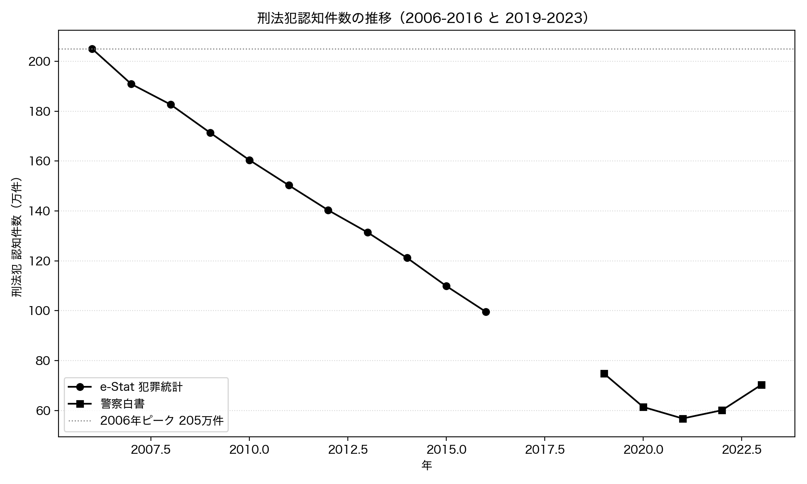
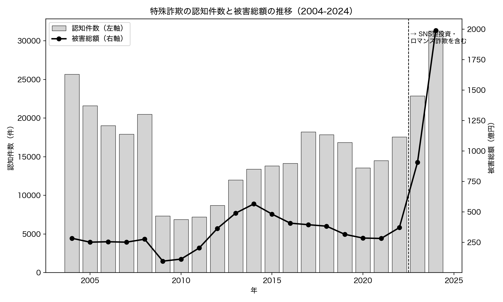

# 第6章 犯罪・安全 — 体感と事実のギャップ

「Python × 公開データ分析 30選」第6章のサンプルコードと分析結果です。

「最近は物騒になった」という体感と、警察庁が公開する犯罪統計の事実を突き合わせます。Recipe 19 では刑法犯の認知件数が長期でどう動いたかを、Recipe 20 では特殊詐欺の被害額がどう変わってきたかを調べます。この 2 つを並べると、「全体としての犯罪は減っているが、特定の手口は逆に増えている」という、体感と事実のギャップの正体に近い構図が見えてきます。すべてのコードは単独で実行でき、結果のグラフは `images/` に出力されます。

## セットアップ

```bash
pip install -r ../../requirements.txt
```

各スクリプトは初回実行時にデータを取得して `data/` にキャッシュし、2 回目以降はキャッシュを使います。

### e-Stat API キー（Recipe 19 で必要）

Recipe 19 は、政府統計の総合窓口 [e-Stat](https://www.e-stat.go.jp/) の API を使います（Recipe 20 は警察庁の公開 CSV のみで API キー不要）。利用は無料ですが、アプリケーション ID（`appId`）の発行が必要です。

1. [e-Stat](https://www.e-stat.go.jp/) で利用登録する
2. マイページの「API 機能（アプリケーション ID 発行）」で `appId` を発行する
3. このディレクトリ（`chapters/ch06/`）に `.env` ファイルを作り、次の 1 行を書く

```text
ESTAT_APP_ID=発行されたあなたのID
```

`.env` は `.gitignore` で除外されており、コミットされません。

## Recipe 19: 日本の犯罪は本当に減っているか

```bash
python recipe19_crime_trend.py
```

刑法犯の認知件数（警察が事件として把握した件数）が長期でどう動いたかを調べます。長期の推移を見るため、e-Stat の犯罪統計（2006-2016 年、API キー必要）と警察白書の公開 CSV（2019-2023 年、キー不要）という 2 つの出典を、同じ定義の「刑法犯総数 認知件数」として接続します。減少局面が直線的かどうかを線形回帰で確かめます。

**結果**: 認知件数は取得範囲の最大である 2006 年の 2,050,850 件から、2016 年には 996,120 件へと 10 年で半分以下に減少。2006-2016 年の減少トレンドは傾き -103,240 件/年、相関係数 r=-0.999 とほぼ完全な直線でした。2021 年には 568,104 件まで下がり、これは 2006 年ピークの 27.7% にあたります。「物騒になった」という体感とは逆に、長期では犯罪の認知件数は大きく減っています。ただし 2021 年を底に 2023 年は 703,351 件まで +23.8% 反転しており、近年はやや増加に転じています。それでも 2023 年はピークの 34.3% 水準にとどまります。認知件数は警察が把握した件数であり、被害届の出ない犯罪（暗数）は含まない点に注意します。



## Recipe 20: 特殊詐欺の被害額は増えているか

```bash
python recipe20_special_fraud.py
```

オレオレ詐欺などの特殊詐欺について、認知件数と被害総額が年次でどう動いたかを調べます。Recipe 19 の「全体は減っている」と対になる分析です。警察庁の特殊詐欺統計 CSV（API キー不要、Shift_JIS、和暦・全角数字のブロック構造）を解析し、手口別内訳のセクションを除いて特殊詐欺全体の年次表だけを抽出します。

**結果**: 被害総額は 2004 年の 283.8 億円から 2024 年の 1,990.7 億円へ約 7.0 倍に増加。線形回帰でも 1 年あたり +35.1 億円（p=0.0102）の有意な増加トレンドがあり、1 件あたりの被害額は 2024 年で 636.4 万円に達します。全体の犯罪が減るなかで特殊詐欺の被害が増えていることが、体感とのギャップの正体に近いものです。ただし注意が必要で、このデータの「特殊詐欺」は 2023 年から SNS 型投資詐欺・ロマンス詐欺を含むようになりました。2024 年の被害総額 1,990.7 億円の内訳は、特殊詐欺のみが 717.6 億円（認知 21,043 件）、SNS 型投資・ロマンス詐欺が 1,271.9 億円（認知 10,237 件）です。直近の急増は新たに集計対象へ加わった SNS 型の影響が大きく、「定義の拡大」と「実態の増加」が混ざっています。それでも特殊詐欺のみで 717.6 億円は過去最悪で、増加トレンド自体は実態として存在します。


