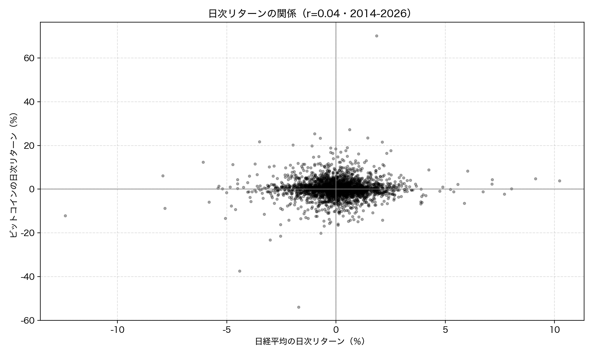
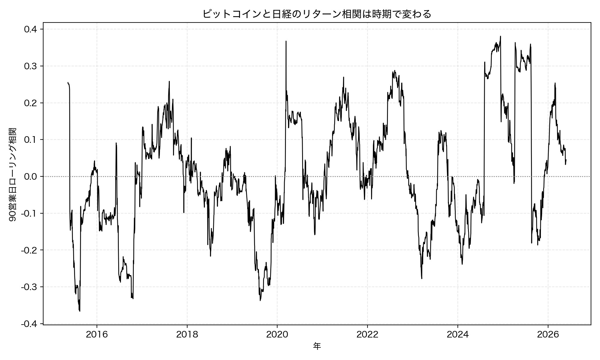
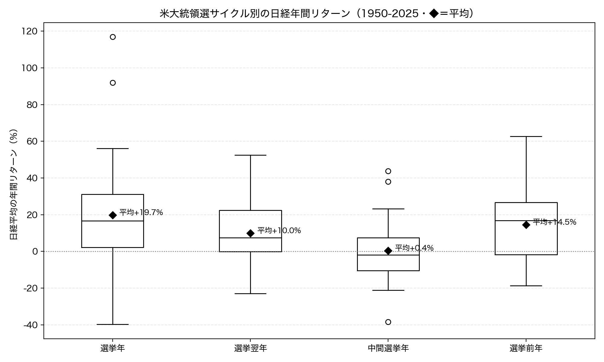

# 第7章 株価・金融 — データで投資を考える

「Python × 公開データ分析 30選」第7章のサンプルコードと分析結果です。

「リスク資産は同じ方向に動く」「大統領選の年は株が上がる」。相場にあふれる経験則を、金融データで検証します。Recipe 21 ではビットコインと日経平均が「いつも一緒に動く」のかを日次リターンの相関で、Recipe 22 では「大統領選の年は株が上がる」という経験則が日経平均にも当てはまるかを過去 76 年のデータで調べます。すべてのコードは単独で実行でき、結果のグラフは `images/` に出力されます。

> この章は投資の助言ではありません。過去のデータにこういう傾向があったという事実を確認するだけで、将来の値動きを予測したり特定の売買を勧めたりするものではありません。データの読み方を学ぶ題材として読んでください。

## セットアップ

```bash
pip install -r ../../requirements.txt
```

各スクリプトは初回実行時にデータを取得して `data/` にキャッシュし、2 回目以降はキャッシュを使います。

**この章は API キー不要です。** 両レシピとも [FRED](https://fred.stlouisfed.org/)（米セントルイス連邦準備銀行）の公開 CSV を使います。系列 ID を URL に指定するだけでダウンロードでき、登録もキーも不要です。

## Recipe 21: ビットコインと日経平均は連動しているか

```bash
python recipe21_btc_nikkei.py
```

ビットコイン価格（FRED `CBBTCUSD`）と日経平均（FRED `NIKKEI225`）を日次終値で取得し、両方に終値がある共通営業日だけを残します。価格そのものではなく、前日比の変化率（日次リターン、`pct_change()`）に変換してから相関を取るのがポイントです。さらに 90 営業日ローリング相関で、連動の強さが時期によって変わるかを見ます。

**結果**: 価格水準どうしの相関は r=0.877 と高いものの、これは両方が長期で値上がりしてきたことによる「見せかけの相関」です。日次リターンに変換して「日々同じ方向に動くか」を見ると相関は r=0.042（p=0.026, 共通営業日 2,785 日）とほぼゼロで、「いつも一緒に動く」とは言えません。年ごとに分けても 2016 年 r=-0.159、2024 年 r=+0.176 と符号すら一定せず、90 営業日ローリング相関も -0.37 から +0.38 の範囲で揺れ動きます。価格をそのまま比べると連動して見え、変化率に直すと連動していない。時系列データで「一緒に動くか」を見るときは、必ず変化率に直してから相関を取るのが鉄則です。





## Recipe 22: 日経平均は米大統領選の年に上がるか

```bash
python recipe22_nikkei_election.py
```

日経平均（FRED `NIKKEI225`、1949 年から収録）の年間リターン（年初→年末の変化率）を、米大統領選の 4 局面（選挙年・選挙翌年・中間選挙年・選挙前年）に分けて比べます。選挙年は 4 で割り切れる年なので `year % 4` の余りで分類できます。平均だけでなく中央値・標準偏差・上昇年率も併記して、外れ値やばらつきを見落とさないようにします。

**結果**: 1950-2025 年の 76 年（各局面 19 年）で見ると、選挙年の年間リターンは平均 +19.74%・上昇年率 79% で最も高く、中間選挙年は平均 +0.38%・中央値 -1.87%・上昇年率 42% と唯一プラスの年が半分を割り込みます（米国相場で知られる「中間選挙の谷」と整合）。経験則は傾向としては当てはまりました。ただし鵜呑みは禁物で、選挙年は標準偏差 38.4 とばらつきが突出して大きく、高い平均は 1952 年（+117%）や 1972 年（+92%）など高度成長期の大幅高に押し上げられています。近年の選挙年では 2008 年（-40%）・2000 年（-27%）と大きく下げた年もあります。各局面わずか 19 年のサンプルで、米国の選挙暦が日本株を動かす直接の因果も想定しにくく、「傾向はあるが個々の年は予測できない」というのが正しい距離感です。


