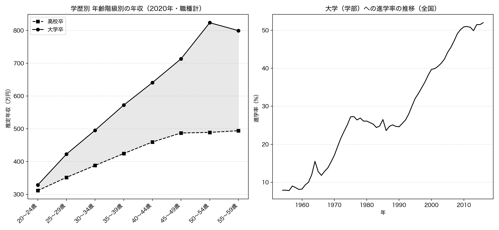
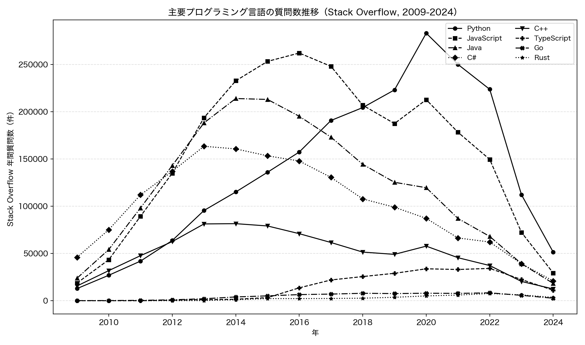

# 第8章 教育・キャリア — 数字で見る「学びの価値」

「Python × 公開データ分析 30選」第8章のサンプルコードと分析結果です。

「大学に行くと生涯年収が高くなる」「これからはこの言語が来る」。進路やキャリアの語りを、公的統計と開発者コミュニティのデータで確かめます。Recipe 23 では大学卒と高校卒の生涯賃金の差を賃金構造基本統計調査から試算し、Recipe 24 ではプログラミング言語の人気がこの 15 年でどう移り変わったかを Stack Overflow の質問数で追います。すべてのコードは単独で実行でき、結果のグラフは `images/` に出力されます。

## セットアップ

```bash
pip install -r ../../requirements.txt
```

各スクリプトは初回実行時にデータを取得して `data/` にキャッシュし、2 回目以降はキャッシュを使います。

### e-Stat API キー（Recipe 23 で必要）

Recipe 23 は、政府統計の総合窓口 [e-Stat](https://www.e-stat.go.jp/) の API を使います（Recipe 24 は Stack Exchange API のみで API キー不要）。利用は無料ですが、アプリケーション ID（`appId`）の発行が必要です。

1. [e-Stat](https://www.e-stat.go.jp/) で利用登録する
2. マイページの「API 機能（アプリケーション ID 発行）」で `appId` を発行する
3. この章のディレクトリに `.env` ファイルを作り、次の 1 行を書く（`.env` は `.gitignore` 済みでコミットされません）

```bash
ESTAT_APP_ID=発行されたあなたのID
```

## Recipe 23: 大学を出ると生涯年収はどれだけ変わるか

```bash
python recipe23_education_wage.py
```

賃金構造基本統計調査の「学歴、年齢階級別データベース」（e-Stat `0003426415`、賃金額は 2020 年収録）を取得します。この表には「職種計」の合計値がないため、職種別の所定内給与額・年間賞与を労働者数で加重平均して職種計の賃金カーブを再構成します。年収（月給 × 12 + 年間賞与）を 20 代前半から 50 代後半までの 8 階級ぶん積み上げて、生涯賃金を試算します。あわせて大学進学率の長期推移（学校基本調査 `0003147040`）も確認します。

**結果**: 20 代前半の年収は高校卒 311.2 万円・大学卒 328.4 万円とほぼ互角ですが、年齢とともに差が開き、ピークは高校卒 494.1 万円（55～59 歳）に対し大学卒 823.9 万円（50～54 歳）に達します。これを働く期間ぶん積み上げた生涯賃金の試算は高校卒 1.70 億円（17,024 万円）・大学卒 2.40 億円（23,984 万円）で、差はおよそ 6,960 万円、倍率にして 1.41 倍でした。大学（学部）への進学率は 1954 年の 7.9% から 2016 年の 52.0% へ大きく上昇しています。ただしこの生涯賃金は 2020 年の各世代の賃金を並べた試算（個人の予測ではない・退職金や年金を含まない）であり、賃金差のすべてが学歴そのものの効果とは限りません。大学に進む層の家庭環境や学力などの背景要因（交絡）が混ざった相関であって、因果ではない点に注意が必要です。



## Recipe 24: プログラミング言語の人気はどう移り変わったか

```bash
python recipe24_language_trend.py
```

プログラミング言語の「人気」を、Stack Overflow にその言語について新しく投稿された質問の数で近似します。Stack Exchange API はフィルタに `total` を指定すると、条件に合う質問の総数だけを返すので、言語タグと期間（`fromdate` / `todate`）を指定して各年の質問数を集計します。8 つの主要言語について 2009 年から 2024 年までの推移を比べます。少量の利用なら API キーは不要です。

**結果**: 15 年で言語の主役は入れ替わりました。2009 年の首位は C#（45,885 件）でしたが、2024 年の首位は Python（51,416 件）です。各言語のピーク年は C# 2013 → Java・C++ 2014 → JavaScript 2016 → Python 2020 → TypeScript・Go・Rust 2022 と、新しく広まった言語ほど後ろにずれ、世代交代がはっきり表れています。一方で 8 言語の合計質問数は 2016 年の 855,980 件をピークに、2024 年には 149,528 件（ピーク比 17.5%）まで激減しました。これは個々の言語の衰退というより、生成 AI（ChatGPT など）の普及で Stack Overflow に質問する習慣そのものが減った影響が大きく含まれます。質問数は人気の完全な指標ではないため、絶対数の増減を言語の盛衰だけに結びつけることはできず、「言語どうしの相対的な勢力図の移り変わり」として読むのが妥当です。


