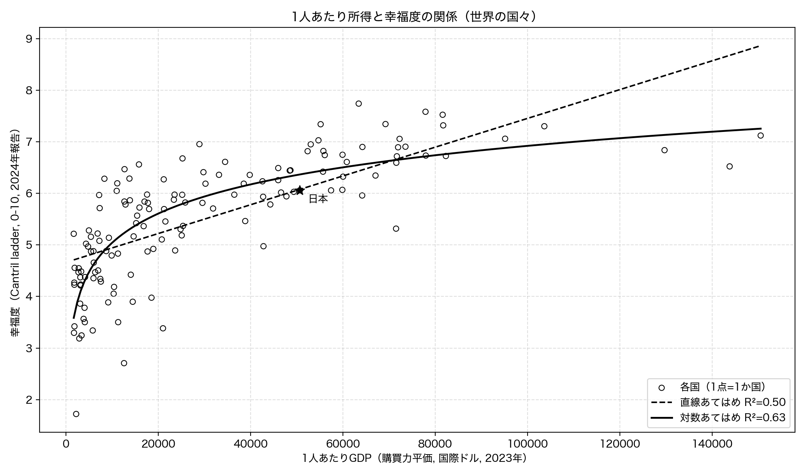
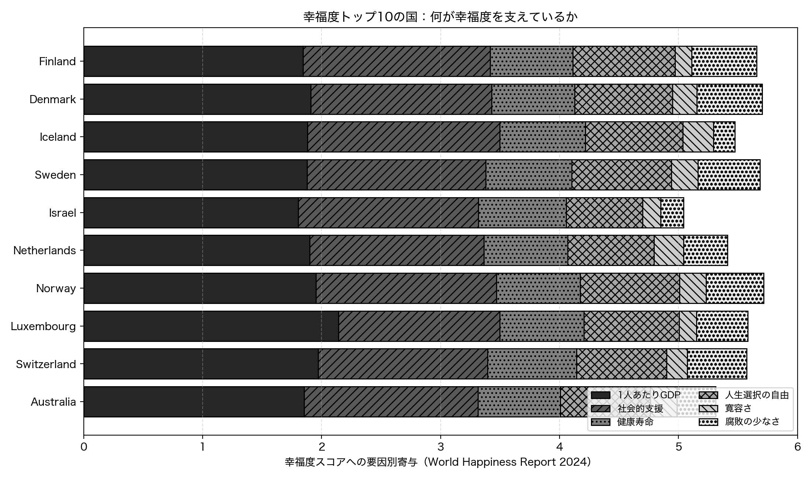
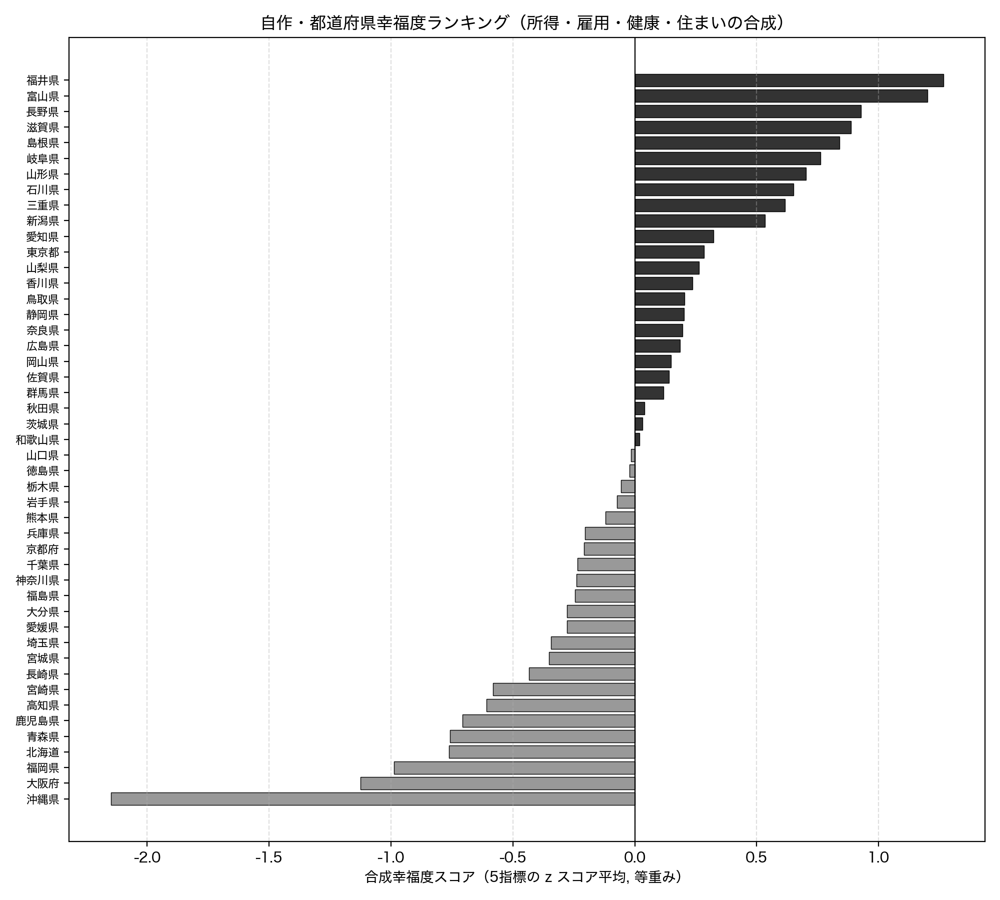

# 第9章 国際比較 — 世界の中の日本

「Python × 公開データ分析 30選」第9章のサンプルコードと分析結果です。

「お金があれば幸せになれる」「経済大国は豊かで幸せだ」。お金と幸せをめぐる語りを、世界各国の幸福度データと所得・GDP のデータで確かめます。Recipe 25 では 1 人あたりの所得と幸福度が比例するかを、Recipe 26 では経済規模の大きい国が幸せかを国際比較し、Recipe 27 では複数の指標を合成して「自分なりの都道府県幸福度ランキング」を作ります。すべてのコードは単独で実行でき、結果のグラフは `images/` に出力されます。

## セットアップ

```bash
pip install -r ../../requirements.txt
```

各スクリプトは初回実行時にデータを取得して `data/` にキャッシュし、2 回目以降はキャッシュを使います。Recipe 25 と Recipe 26 は World Happiness Report の取得結果を共有します。

### e-Stat API キー（Recipe 27 で必要）

Recipe 27 は、政府統計の総合窓口 [e-Stat](https://www.e-stat.go.jp/) の API を使います（Recipe 25・26 は World Happiness Report の GitHub CSV と World Bank API のみで API キー不要）。利用は無料ですが、アプリケーション ID（`appId`）の発行が必要です。

1. [e-Stat](https://www.e-stat.go.jp/) で利用登録する
2. マイページの「API 機能（アプリケーション ID 発行）」で `appId` を発行する
3. この章のディレクトリに `.env` ファイルを作り、次の 1 行を書く（`.env` は `.gitignore` 済みでコミットされません）

```bash
ESTAT_APP_ID=発行されたあなたのID
```

## Recipe 25: 年収と幸福度は比例するか

```bash
python recipe25_income_happiness.py
```

各国の幸福度（World Happiness Report 2024 の Cantril ladder スコア, 0-10）と 1 人あたりの所得（世界銀行の 1 人あたり GDP, 購買力平価ドル, `NY.GDP.PCAP.PP.CD`, 2023 年）を国名で突き合わせます。所得をそのまま使った直線のあてはめと、所得を対数に変換したあてはめを比べ、決定係数（R の 2 乗）でどちらがデータをよく説明するかを確かめます。

**結果**: 139 か国を突合。1 人あたり GDP と幸福度には強い相関がありますが、所得そのままの直線あてはめ（決定係数 0.505, r=0.710）より、所得を対数に変換したあてはめ（決定係数 0.634, r=0.797）のほうがデータをよく説明します。つまり関係は比例ではなく頭打ち（収穫逓減）で、所得が 2 倍になっても幸福度は約 0.57 ポイントしか上がりません。所得が上位 25% の国々（平均 GDP $74,010・幸福度 6.78）は下位 25%（平均 GDP $4,105・幸福度 4.30）の 18 倍の所得がありますが、幸福度の差は 2.48 ポイントにとどまります。日本は GDP $50,662・幸福度 6.06 でした。これは国の平均値どうしの比較（生態学的相関）であり、個人の年収と幸福度の関係に読み替えることはできません。相関は因果でもありません。



## Recipe 26: 経済規模が大きい国は幸せか

```bash
python recipe26_gdp_happiness_intl.py
```

国全体の GDP 総額（世界銀行 `NY.GDP.MKTP.CD`, 2023 年）と幸福度を突き合わせ、経済規模ランキングと幸福度ランキングのズレ、地域差、そして幸福度トップ 10 の国で 6 要因（1 人あたり GDP・社会的支援・健康寿命・人生選択の自由・寛容さ・腐敗の少なさ）のうち何が大きいかを見ます。

**結果**: 140 か国を突合。経済規模ランキングと幸福度ランキングは大きくズレます。GDP 総額 1 位の米国は幸福度 23 位、2 位の中国は 58 位、4 位の日本は 50 位、5 位のインドは 124 位で、経済規模トップ 10 で幸福度が最も高いのは GDP 10 位のカナダ（幸福度 15 位）でした。地域別の平均幸福度は北米・豪 NZ の 6.93 が最高、南アジアの 3.90 が最低です（西欧 6.84、東アジア 5.82、サブサハラ・アフリカ 4.33）。幸福度トップ 5 の国（フィンランドなど）はいずれも、1 人あたり GDP の寄与（フィンランドで 1.84）よりも社会的支援・健康寿命・自由などその他 5 要因の合計（3.81）のほうが大きく、幸福度を支える主役は経済力だけではありませんでした。幸福度は主観的評価で文化の影響を受け、6 要因は寄与の推定値であって因果効果ではない点に注意が必要です。



## Recipe 27: 都道府県幸福度ランキングを自分で作る

```bash
python recipe27_pref_happiness.py
```

e-Stat の社会生活統計指標から 5 つの都道府県別指標（1 人当たり県民所得・完全失業率・平均余命・持ち家の広さ・持ち家比率）を取得し、z スコア（標準化）でそろえてから合成して、自分なりの幸福度ランキングを作ります。「低いほど良い」完全失業率は符号を反転させます。さらに、所得の重みを変えるとランキングがどう動くか（重み感度分析）を確かめます。

**結果**: 5 指標を z スコアで標準化して等重みで合成すると、1 位は福井県（スコア +1.266）、2 位富山県、3 位長野県となり、最下位は沖縄県（-2.149）でした。福井県が 1 位なのは所得（z スコア +0.54）が飛び抜けて高いからではなく、持ち家の広さ（+1.98）・低い失業率（+1.88）・長寿（+0.90）といった生活基盤の指標が高いためです。ここで所得の重みだけを 3 倍にすると、1 位は福井県から東京都に変わり（12 位 → 1 位）、鳥取県は 15 位から 29 位へと最大 14 位も順位を落としました。合成指標は「何を大事だと考えるか」でいくらでも姿を変える、作り手の価値観が入った主観的なものです。これは公式の幸福度ではなく、各指標は相関であって因果でもありません。なお指標ごとに全 47 都道府県がそろう最新年を採用したため、観測年は指標間で一致しません（県民所得 2021 年・完全失業率と平均余命 2020 年・住居関連 2023 年）。


