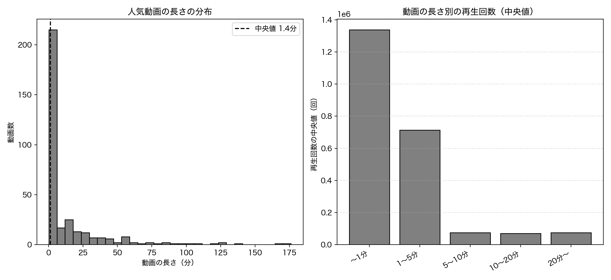
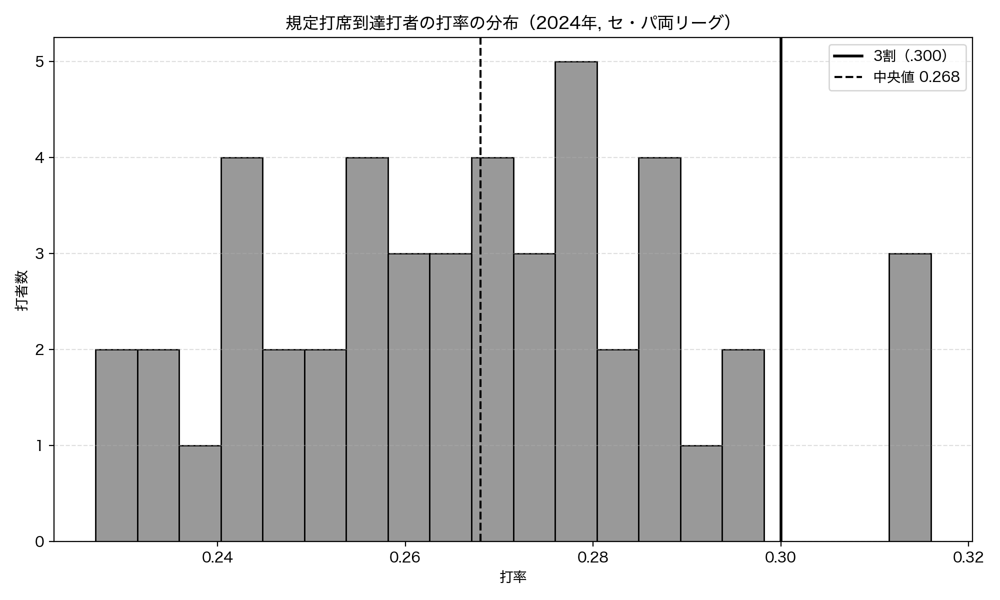
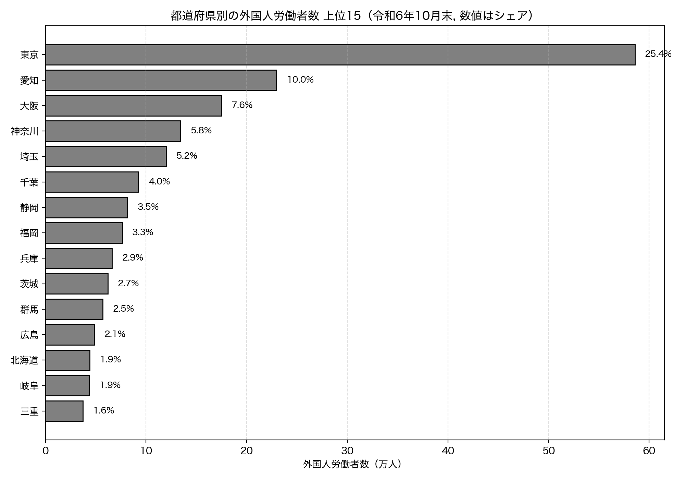

# 第10章 SNS・エンタメ — 身近なデータを分析する

「Python × 公開データ分析 30選」第10章のサンプルコードと分析結果です。

ニュースや統計から少し離れて、もっと身近な題材をデータで掘ります。Recipe 28 では YouTube の人気動画の長さの分布から「伸びるのは短い動画か長い動画か」を、Recipe 29 では「打率3割は一流」が本当に希少なのかを打率の分布から、Recipe 30 では外国人労働者がどの都道府県に多いかを構成比と集中度で確かめます。この章では特に「平均だけでは見えないものを、分布や構成比で見る」という切り口を重視します。すべてのコードは単独で実行でき、結果のグラフは `images/` に出力されます。

## セットアップ

```bash
pip install -r ../../requirements.txt
```

各スクリプトは初回実行時にデータを取得して `data/` にキャッシュし、2 回目以降はキャッシュを使います。Recipe 28 には書籍と同じ数値を再現できるよう、取得済みデータ（`data/recipe28_youtube.csv`）を同梱しています（YouTube の人気動画チャートは日々変わるため、削除して実行し直すと最新の数値になります）。

### YouTube Data API キー（Recipe 28 で必要）

Recipe 28 は YouTube Data API v3 を使います（Recipe 29・30 は API キー不要）。同梱のキャッシュをそのまま使えば API キーなしで書籍の数値を再現できますが、最新データを取り直す場合は API キーが必要です。

1. [Google Cloud Console](https://console.cloud.google.com/) でプロジェクトを作成（または既存のものを選択）
2. 「API とサービス」→「ライブラリ」で **YouTube Data API v3** を有効化
3. 「認証情報」→「API キーを作成」でキーを発行
4. この章のディレクトリに `.env` ファイルを作り、次の 1 行を書く（`.env` は `.gitignore` 済みでコミットされません）

```bash
YOUTUBE_API_KEY=発行されたあなたのキー
```

## Recipe 28: 再生回数が多いのは長い動画か、短い動画か

```bash
python recipe28_youtube_duration.py
```

日本で人気の動画を 7 カテゴリ横断で集め、動画の長さ（秒）と再生回数の関係を見ます。まず動画の長さの分布をヒストグラムで眺め、長さと再生回数の相関、長さ別の再生回数の中央値を比べます。ISO 8601 形式の長さ（`PT1H2M3S`）は正規表現で秒に変換し、桁が大きく開く再生回数は対数に変換してから相関を取ります。

**結果**: 人気動画 330 本の長さは中央値 81 秒（1.4 分）で、4 割（40.9%）が 1 分未満でした。平均は 826 秒（13.8 分）と中央値から大きくかけ離れていますが、これは一部の長い動画に引っ張られた値で、分布は短い側に大きく偏っています（中央値と平均がズレる、右に歪んだ分布の典型）。長さと再生回数には負の相関（r=-0.474）があり、長さ別の再生回数の中央値は 1 分未満が約 134 万回に対し、5 分超は約 7 万回と約 18 倍の差でした。ただしこれは「人気動画」という偏った標本での話で、再生回数は公開からの経過時間にも左右され、相関は因果ではありません。人気動画チャートは日々変わるため、数値は取得時点のスナップショットです。



## Recipe 29: プロ野球の打率は「3割で一流」か

```bash
python recipe29_batting_average.py
```

規定打席に到達した打者の打率を NPB.jp の個人打撃成績ページから集め、打率の分布を描きます。3 割（.300）が分布のどこに位置するか、3 割以上が全体の何パーセントかを見て、「3 割は一流」という目安をデータで確かめます。HTML テーブルは `pandas.read_html()` で読み取り、文字化けは `apparent_encoding` で防ぎます。

**結果**: 2024 年に規定打席へ到達した打者は両リーグ合わせて 47 人。打率は平均 0.267・中央値 0.268 で、分布の山は .260〜.280 あたりに集まっています。3 割を超えたのはわずか 3 人（6.4%）で、3 割はレギュラー級でも上位 6.4% に入る希少な水準でした（オースティン .316 / サンタナ .315 / 近藤健介 .314）。一方 .250 以上は 36 人（76.6%）が届いており、「3 割の壁」の高さが際立ちます。なお対象は規定打席到達者のみで、全選手で見れば 3 割打者はさらに希少です。単年データのため年によって人数は変動します。



## Recipe 30: 外国人労働者はどの都道府県に多いか

```bash
python recipe30_foreign_workers.py
```

厚生労働省「外国人雇用状況」の届出状況（別表２）の Excel から、都道府県別の外国人労働者数を取得し、ランキングと構成比（シェア）、上位への集中度を見ます。Excel は `requests` で取得したバイト列を `io.BytesIO` でくるんで `pandas.read_excel()` に渡し、見出しや合計行が混ざる表は `header=None` で読んで `iloc` で必要な部分を取り出します。

**結果**: 令和 6 年 10 月末時点で外国人労働者は全国 2,302,587 人と過去最多。そのうち 25.4%（585,791 人）が東京に集中し、続く愛知（10.0%）、大阪（7.6%）、神奈川（5.8%）、埼玉（5.2%）まで含めた上位 5 都道府県で全体の 54.0%、上位 10 都道府県で 70.5% を占めます。最下位の秋田は 3,536 人（0.2%）で、東京は秋田の 166 倍でした。都市部・製造業集積地への強い偏りが見えます。ただし絶対数は就業者総数（人口規模）に左右されるため、偏りを論じるときは人口規模との関係にも注意が必要です。


